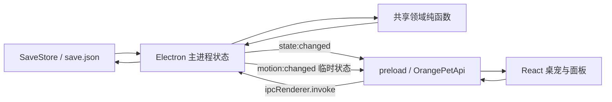

# 架构与数据流

| 控制项 | 内容 |
| --- | --- |
| 文档级别 | `LIVING` |
| 修改权限 | 架构、进程职责或状态流变化时同步更新 |
| 适用版本 | 1.1.0 |
| 最后核对 | 2026-08-15 |
| 权威源码 | `src/main/main.ts`、`src/main/store.ts`、`src/preload/preload.ts`、`src/shared/`、`src/renderer/` |
| 更新触发 | 新增进程、窗口、IPC、持久化路径、领域模块或状态所有权变化 |

受保护的权限边界见[架构与安全准则](../governance/ARCHITECTURE_SECURITY.md)。本文只描述当前实现，不得用来放宽安全准则。

## 当前已实现

### 技术栈和入口

- Electron 主进程入口由 `package.json.main` 指向 `dist-electron/main/main.js`，源码为 `src/main/main.ts`。
- preload 源码为 `src/preload/preload.ts`，使用 `contextBridge` 暴露 `window.orangePet`。
- React 入口为 `src/renderer/main.tsx`；`src/renderer/App.tsx` 通过查询参数 `view=pet|panel` 渲染桌宠或管理面板。
- `src/shared/` 是不依赖 Electron 或 DOM 的共享领域层，包含类型、成长收益、装扮目录和表情解析。
- Vite 构建渲染层到 `dist/`；TypeScript 构建主进程、preload 和共享模块到 `dist-electron/`。

### 模块职责

| 模块 | 当前职责 |
| --- | --- |
| `src/main/main.ts` | 应用生命周期、两个窗口、托盘、菜单、全屏检测、自动散步、IPC、定时推进和状态广播 |
| `src/main/store.ts` | 主存档、临时文件、备份恢复、首次默认档与启动离线结算 |
| `src/main/motion.ts` | 移动方向、时长和插值计算 |
| `src/preload/preload.ts` | 将允许的 IPC 封装成 `OrangePetApi` |
| `src/shared/types.ts` | 存档、动作、设置、移动和公开 API 类型 |
| `src/shared/game.ts` | 属性衰减、成长、收益、互动、购买和浅层存档校验 |
| `src/shared/catalog.ts` | 装扮稳定 ID 与商品目录 |
| `src/shared/expression.ts` | 行为、需求和待机表情优先级 |
| `src/renderer/App.tsx` | 桌宠图层、面板四页、用户输入和 API 调用 |
| `src/renderer/styles.css` | 桌宠图层定位、表情、动作、装扮和面板视觉 |

### 运行时数据流

主进程内的 `state: SaveData` 是运行时持久状态的唯一所有者。渲染层读取状态快照、提交意图，不直接写磁盘，也不直接持有 Electron 权限。

### 启动与保存顺序

1. `app.whenReady()` 创建 `SaveStore(app.getPath('userData'))`。
2. `SaveStore.load()` 尝试主档、备份、默认档，执行离线结算并立即写回。
3. 主进程注册 IPC，创建桌宠窗口、管理面板和托盘，再启动周期任务。
4. 互动、设置、购买和装备由主进程修改状态，随后保存、广播并重建菜单。
5. 步态的移动中标志和方向只经 `motion:changed` 广播，不进入存档；最终位置写入 `settings.petPosition`。
6. 每分钟推进状态并保存；正常退出再次保存。

## 待批准规划

以下均未实现，也未因写入本文而获得开发许可：

- 将分散常量集中到版本化配置模块。
- 为 IPC 增加运行时响应结构校验和集成测试。
- 建立明确的动作状态机、动作队列或领域事件总线。
- 增加逐版存档迁移器和迁移注册表。

## 失败与边界情况

- 主档无效时会尝试备份；两者都无效会创建默认档。当前无迁移链，详见[存档规格](SAVE_SCHEMA_AND_MIGRATIONS.md)。
- 渲染窗口销毁或不可用时，广播会跳过该窗口。
- 桌宠移动、睡眠、互动、管理面板焦点和前台全屏窗口之间存在取消关系，但还不是统一状态机。
- 主进程是内存状态权威；渲染层收到的 `SaveData` 只是快照，不能假设本地副本持续最新。
- Git 历史从当前 1.1.0 文档基线开始；更早的架构演变仍不能由提交历史证明，只能结合现存发布归档核对。详见[当前实现状态](../status/CURRENT_IMPLEMENTATION.md)。

## 相关测试

- `src/shared/game.test.ts`
- `src/shared/expression.test.ts`
- `src/main/motion.test.ts`
- `src/main/store.test.ts`
- `src/renderer/ui-regressions.test.ts`

当前没有完整 Electron IPC、窗口生命周期或多进程端到端测试。
