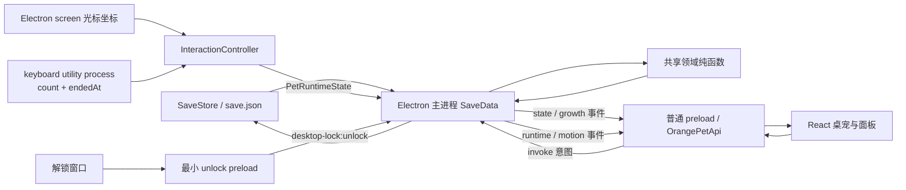

# 架构与数据流

| 控制项 | 内容 |
| --- | --- |
| 文档级别 | `LIVING` |
| 修改权限 | 架构、进程职责或状态流变化时同步更新 |
| 适用版本 | 1.2.3 |
| 最后核对 | 2026-08-23 |
| 权威源码 | `src/main/main.ts`、`src/main/store.ts`、`src/main/interaction-controller.ts`、`src/main/keyboard-worker.ts`、`src/preload/`、`src/shared/`、`src/renderer/`、`package.json` |
| 更新触发 | 新增进程、窗口、IPC、持久化路径、原生依赖、领域模块、运行时时钟或状态所有权变化 |

受保护的权限边界见[架构与安全准则](../governance/ARCHITECTURE_SECURITY.md)。本文只描述当前实现，不得用来放宽安全准则。

## 当前已实现

### 进程、入口与信任边界

| 运行单元 | 入口 | 权限与职责 |
| --- | --- | --- |
| Electron 主进程 | `src/main/main.ts` → `dist-electron/main/main.js` | 唯一持有存档、BrowserWindow、托盘、应用菜单、全局光标采样、原生键盘子进程、定时推进和系统生命周期权限 |
| 桌宠/面板 preload | `src/preload/preload.ts` | 在 `contextIsolation=true`、`sandbox=true`、`nodeIntegration=false` 下把允许的 invoke/事件包装为 `window.orangePet` |
| 解锁 preload | `src/preload/unlock.ts` | 只暴露 `window.orangePetUnlock.unlock()`，不共享存档、设置、购买或退出能力 |
| React 渲染层 | `src/renderer/main.tsx` | 根据 `view=pet|panel` 渲染桌宠或管理面板，只持有快照和本地 UI 状态，不直接读写磁盘、Electron API 或原生输入 |
| 键盘 utility process | `src/main/keyboard-worker.ts` → `dist-electron/main/keyboard-worker.js` | 在与主进程隔离的 Electron `utilityProcess` 内加载 `uiohook-napi`，只聚合按键节奏并向父进程发送最小消息 |

主进程与 preload 由 TypeScript 构建到 `dist-electron/`，React 由 Vite 构建到 `dist/`。发布包使用 ASAR，`uiohook-napi` 固定版本的原生文件通过 `asarUnpack` 规则解包。当前没有联网、遥测、广告、账号或远程配置数据流。

### 模块职责

| 模块 | 当前职责 |
| --- | --- |
| `src/main/main.ts` | 应用生命周期、三个窗口、托盘/菜单、锁定副作用、全屏检测、自动散步、原生输入编排、IPC、运行时时钟、保存和广播 |
| `src/main/interaction-controller.ts` | 临时互动状态机、优先级、冷却、点击结算、拖动、光标手势和键盘节奏编排 |
| `src/main/keyboard-worker.ts` | 启停原生键盘钩子，只对 `keydown` 增加本地计数，定期发送 `{type:'key-bucket',count,endedAt}` |
| `src/main/store.ts` | schema 2 主存档、临时文件、备份恢复、schema 1 迁移、启动离线结算与带摘要加载 |
| `src/main/motion.ts` | 移动方向、时长和缓动插值纯计算 |
| `src/preload/preload.ts` | 把普通窗口允许的 IPC 封装为类型化 `OrangePetApi` |
| `src/preload/unlock.ts` | 将独立解锁按钮绑定到唯一解锁 IPC |
| `src/shared/types.ts` | 存档、设置、领域行为、临时互动、启动快照和公开 API 类型 |
| `src/shared/game.ts` / `growth.ts` | 属性衰减、在线/离线结算、成长、有效照料、经验里程碑与存档校验/迁移 |
| `src/shared/economy.ts` / `economy-types.ts` | 金币消耗、背包、服务、限时效果队列、探索实际运行时推进、稳定 ID 和返回码 |
| `src/shared/interaction.ts` | 互动常量、四阶段轮廓、优先级与光标/键盘启发式纯函数 |
| `src/shared/catalog.ts` / `expression.ts` | 稳定商品/旅行目录与行为/需求/待机表情解析 |
| `src/renderer/App.tsx` | 启动快照读取、状态/临时互动/成长事件订阅与视图路由 |
| `src/renderer/pet-view.tsx` | 桌宠分层、表情、限时效果、交互动画、点击/拖动/右键手势 |
| `src/renderer/panel-view.tsx` | 状态、照料、装扮、用品/服务、探索/旅行册和设置界面 |
| `src/renderer/styles.css` | 分层定位、四阶段视觉、表情、交互动画、限时效果和面板布局 |

### 持久状态与临时状态数据流

主进程中的 `state: SaveData` 是持久状态的唯一运行时所有者。领域函数返回新结果，主进程验证意图、原子替换状态、保存并广播。渲染层的 `SaveData` 只是快照，不得假设本地副本一直最新。

`PetRuntimeState` 同样由主进程拥有，但不进入存档。它把移动、互动、注视与键盘组件状态一次性广播给两个普通窗口。渲染层只将它映射为 CSS 类、朝向和视觉道具，不决定优先级或窗口移动权。

`state:bootstrap` 在一次 invoke 中返回 `state`、`runtime`、`offlineSummary` 和可选 `growthProgress`，避免渲染层启动时分别读取多个时间点的快照。后续 `growth:progress` 事件只由在线周期推进或有效照料发出，`source` 仅为 `online | care`。

### 启动、保存和实际运行时

1. `app.whenReady()` 创建 `SaveStore(app.getPath('userData'))`，通过 `loadWithSummary()` 读取主档/备份、必要时迁移 schema 1，执行离线结算并返回摘要。
2. 如存档无法安全读取，主进程显示错误框并退出，不创建新档覆盖原档/备份。
3. 主进程创建 `InteractionController`、注册 IPC，再创建桌宠、面板和托盘。如存档标记桌面锁定，在开始定时器前恢复穿透/解锁窗口。
4. 主进程先创建 `RuntimeScheduler`，再只在 Windows、用户已开启键盘互动、同意版本匹配且系统未挂起/锁屏时启动键盘 utility process。
5. 主进程按登记周期执行 `advanceOnline`并保存；另一个更短的 actual-runtime 时钟推进限时效果和探索，普通 tick 只广播，探索完成则立即保存。
6. 照料、设置、锁定、购买、使用物品、探索状态变化会立即保存/广播；拖动和光标拖拽在结束时保存位置。
7. 正常退出先使统一调度器和异步全屏结果失效、解绑电源/显示器监听、停止键盘工作进程，再刷新未计入的在线/经济实际运行时并只保存一次；窗口随后销毁并清空引用。

### 挂起、Windows 锁屏、前台全屏与桌面锁定

这四种状态的语义不同：

| 状态 | 原生输入 | 在线/限时效果/探索时钟 | 窗口互动 |
| --- | --- | --- | --- |
| 系统挂起/睡眠/休眠（Electron `suspend` 事件） | 停止键盘工作进程，用空光标 tick 收束鼠标状态 | 挂起前先刷新并保存，挂起期间冻结；`resume` 使用 `settleOffline`、重置 actual-runtime 基线 | 自动散步和光标采样停止 |
| Windows `lock-screen` | 停止键盘工作进程和光标采样；`unlock-screen` 再按设置/同意恢复 | 当前只有 `systemSuspended` 会冻结时钟，因此单纯 Windows 锁屏期间在线、限时效果和探索仍继续推进 | 自动散步停止 |
| 前台全屏应用 | 鼠标不采样；键盘工作进程仍可聚合计数，但互动控制器不启动/继续陪打 | 继续 | 取消自动移动并收束环境互动 |
| 应用内 `desktopLocked` | 鼠标和已授权键盘节奏可继续用于被动视觉反应 | 继续 | 主体穿透、强制置顶且位置固定，只有独立解锁/托盘/应用菜单能解锁 |

桌宠 `sleeping`或短时照料行为会从主进程光标采样路径中排除，互动控制器也不会使用键盘节奏；已授权键盘 utility process 当前仍保持运行并只生成聚合计数。

### 键盘隐私与安全降级

键盘互动使用固定版本的 `uiohook-napi`，但原生模块不在主进程或渲染层内运行。隐私契约是：

- 默认关闭；用户必须在面板阅读“只统计节奏”说明并提交当前同意版本。
- worker 的 `keydown` 回调不接收/读取事件参数，只增加内存中的 `pendingCount`。
- worker 只发送 `ready` 或 `{type:'key-bucket',count,endedAt}`，不发送键码、字符、修饰键、输入法内容、密码、活动窗口、进程、文本或日志。
- 主进程验证消息对象、类型、正整数计数上限和有限时间戳，然后才交给 `InteractionController`。
- 用户关闭开关、系统挂起/锁屏或应用退出时，主进程发送 `stop` 并在有限宽限后终止 worker。
- 非 Windows、加载失败、启动超时、worker 报错或退出时，只将 `keyboardStatus` 设为 `unavailable`并停用键盘陪打；不影响存档、窗口、鼠标互动和照料。

### IPC 白名单与数据最小化

详细通道/公开方法见 [UI_WINDOWS_SETTINGS_AND_IPC.md](UI_WINDOWS_SETTINGS_AND_IPC.md)。主进程当前强制以下来源边界：

- 面板才能执行照料、设置、锁定、鼠标/键盘开关、购买/使用用品、探索和装扮变更；桌面锁定时这些面板副作用一律拒绝。
- 桌宠窗口才能发起右键菜单、点击、拖动开始/位置/结束；位置更新还要求主进程状态已是 `dragging`。
- 只有桌宠或面板可请求切换面板。
- 只有独立解锁窗口可调用 `desktop-lock:unlock`；该 preload 不能发起其他通道。

读取启动/状态/临时互动和退出通道当前由普通 preload 白名单限制，handler 本身没有再区分桌宠与面板 sender。这一事实不能用于给未来新窗口自动授权。

## 待批准规划

以下仍未实现，也未因写入本文而获得开发许可：

- 为全部 IPC 请求和响应加入统一运行时 schema 验证。
- 建立跨模块的通用领域事件总线或可持久动作队列。
- 为原生键盘工作进程增加端到端启停、打包解包和 Windows 会话边界自动化测试。

## 失败与边界

- 主档无效时会尝试备份；发现未来 schema 或无法安全读取时失败关闭，不覆盖原文件。详见[存档规格](SAVE_SCHEMA_AND_MIGRATIONS.md)。
- 渲染窗口销毁或不可用时，状态/临时互动/成长广播会跳过该窗口。
- Windows 全屏检测依赖隐藏 PowerShell 子进程；超时或解析失败时按“非全屏”处理。
- 已启动的全屏检测子进程可能在退出清理后才返回；调度器代次与退出标志会丢弃该结果，不再访问 Electron `screen`。
- 键盘依赖使用原生预编译文件，开发环境成功加载不代表安装包内必然成功；故障降级能避免拖垮应用，但最终发布仍需 Windows 实装冒烟。
- 桌面锁定、原生输入、多显示器定位和 suspend/resume 当前主要由纯函数测试和源码边界回归保护，没有完整 Electron 端到端测试。

## 相关测试

- `src/shared/game.test.ts`、`growth.test.ts`、`economy.test.ts`、`interaction.test.ts`、`expression.test.ts`：共享领域与互动规则。
- `src/main/store.test.ts`：存档、备份、迁移、启动离线摘要与失败关闭。
- `src/main/motion.test.ts`、`interaction-controller.test.ts`：移动纯函数与临时状态机。
- `src/main/interaction-integration.test.ts`：锁定、原生 worker 载荷、解锁 preload、挂起和经济 IPC 边界的源码回归。
- `src/renderer/ui-regressions.test.ts`：渲染层结构与透明桌宠静态契约。

当前没有完整 Electron IPC、窗口生命周期、utility process 或多进程端到端测试。
